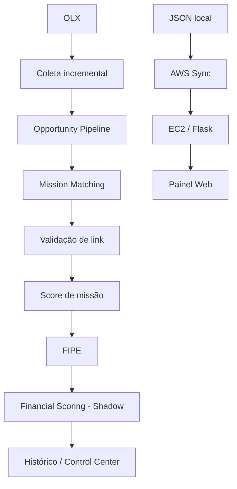

# 🏍️ TH IA MOTOS

**Plataforma de automação e análise de anúncios de motocicletas** — coleta, deduplica, pontua e organiza oportunidades de compra com base em critérios configuráveis pelo usuário.


---

## Visão geral

O IA_Motos coleta anúncios de motocicletas na OLX e no Mercado Livre, evita reprocessar o que já viu, compara cada anúncio novo contra missões de compra cadastradas pelo usuário, valida se o link ainda está ativo, calcula um score de compatibilidade, consulta o valor de referência FIPE e persiste o histórico completo de decisões. Os resultados ficam disponíveis em duas interfaces: um Control Center desktop para operação e análise, e um painel web hospedado na AWS para consulta.

**O projeto usa regras determinísticas e scoring configurável, não um modelo de IA generativa ou machine learning.** Todo score, classificação e recomendação vem de fórmulas e pesos auditáveis no código — nunca de um modelo estatístico ou LLM.

## Problema que o projeto resolve

Buscar manualmente motos à venda em múltiplos marketplaces, comparar preço com a tabela FIPE, filtrar anúncios repetidos e decidir quais vale a pena negociar é um processo repetitivo e demorado. O IA_Motos automatiza a coleta e a triagem inicial, deixando para o usuário a decisão final sobre cada oportunidade.

## Principais funcionalidades

- Coleta automatizada de anúncios na OLX, com paginação e prevenção de duplicidade;
- integração com Mercado Livre (coleta e notificação independentes);
- filtros configuráveis pelo painel, com notificação direta via Telegram;
- Mission Manager — cadastro de missões de compra (marca, modelo, faixa de ano, orçamento, estratégia de negociação);
- Opportunity Engine — casamento de anúncios com missões ativas;
- validação de link antes de qualquer pontuação (descarta anúncios removidos);
- score de missão determinístico e configurável, com motivos, alertas e checklist explicados;
- consulta e cache local de valores FIPE, com resolução conservadora de modelo/ano;
- Financial Scoring em modo shadow — score financeiro experimental baseado na FIPE, calculado em paralelo ao score oficial, sem nunca substituí-lo;
- memória de decisões — histórico completo de cada oportunidade analisada;
- Control Center — aplicação desktop para operação, missões, memória de decisões, analytics e calibração financeira;
- Launcher — início/parada do robô e da sincronização AWS, com status ao vivo;
- painel web (interface_v2) para consulta remota dos anúncios coletados;
- sincronização automática dos dados coletados para a instância AWS.

## Arquitetura



Diagrama completo, com todos os componentes e o papel do Mercado Livre no fluxo: **[Arquitetura completa](docs/architecture.md)**.

### Marketplaces

- **OLX** — pipeline principal, totalmente automatizado (coleta → missões → score → FIPE → histórico).
- **Mercado Livre** — integração real e ativa, mas hoje **não** entra no Opportunity Pipeline da mesma forma que a OLX: os anúncios são coletados e notificados via Telegram por um caminho de código independente.
- **Webmotors** — ferramenta manual separada (`teste_webmotors_motos.py`), usada sob demanda para essa fonte específica; não faz parte do pipeline automático principal. Ver [`docs/operations.md`](docs/operations.md).

## Scoring e FIPE

O score de missão (`core/opportunity_scoring.py`) soma pesos configuráveis por: modelo/marca compatível, ano dentro da faixa, preço dentro da primeira oferta/limite final/orçamento, e aplica penalidade a anúncios com termos de risco (sinistro, leilão, sucata, etc.). O resultado é uma classificação em `EXCELENTE` / `BOA` / `REGULAR` / `DESCARTAR`, com motivos, alertas e um checklist de verificação.

A consulta FIPE (`consultar_fipe.py`) usa a API pública da FIPE com cache local, e resolve o modelo de catálogo correto de forma conservadora — nunca escolhe um modelo ambíguo por adivinhação; quando não há confiança suficiente, retorna erro explícito em vez de um valor errado.

## Financial Scoring — Shadow Mode

`core/financial_scoring.py` calcula, a partir da diferença percentual entre o preço do anúncio e a FIPE, um score financeiro experimental e um preço-alvo de negociação sugerido. Esse cálculo roda **em paralelo** ao score oficial de missão e é gravado como campos adicionais no histórico — nunca substitui `score`/`recomendacao`, que continuam vindo exclusivamente de `core/opportunity_scoring.py`. É observável na tela **Calibração Financeira** do Control Center.

## Control Center

Aplicação desktop (CustomTkinter) para operação da plataforma: Dashboard, status do Robô, gerenciamento de missões (Agente IA), Memória da IA (histórico de decisões), Agent Analytics, Calibração Financeira e Configurações.

## Launcher

Janela de entrada do sistema: iniciar/parar o robô, iniciar/parar a sincronização AWS (com indicador de status ao vivo), abrir o Control Center, abrir o painel web e conectar via SSH à instância AWS.

## Painel Web

`interface_v2` é um painel Flask, hospedado na instância AWS, que lê o histórico de anúncios sincronizado e permite busca e consulta pelos anúncios coletados na OLX, incluindo as fotos reais dos anúncios.

## Sincronização AWS

`sincronizar_aws.ps1` roda em loop contínuo, copiando o arquivo de anúncios coletados para a instância AWS a cada 60 segundos. O Launcher e o `core/aws_sync_process.py` gerenciam esse processo com segurança, sem nunca encerrar um processo não confirmado como pertencente ao sincronizador.

## Tecnologias

- **Python** — linguagem principal;
- **Flask** — painéis web (`interface/`, `interface_v2/`);
- **CustomTkinter** — Control Center e Launcher;
- **Playwright** — automação de navegador para coleta (OLX, Mercado Livre, Webmotors);
- **Requests** — chamadas HTTP (Telegram, FIPE);
- **Pillow / OpenCV / PyAutoGUI** — utilitários de automação e imagem;
- **AWS EC2** — hospedagem do painel web e sincronização de dados;
- **PowerShell** — script de sincronização AWS;
- **Git / GitHub** — versionamento.

## Estrutura do projeto

```
IA_Motos/
├── core/            # motores de scoring, FIPE, pipeline e processos seguros (robô/sync)
├── ui/              # componentes de interface do Control Center
├── interface/        # painel Flask original + dados operacionais coletados
├── interface_v2/     # painel Flask atual, hospedado na AWS
├── scripts/manual/    # ferramentas manuais de diagnóstico (não fazem parte do pipeline automático)
├── docs/             # documentação técnica e operacional
├── assets/           # imagens e recursos estáticos
├── data/             # missões, oportunidades e histórico (dados operacionais, ignorados pelo Git)
├── main.py           # robô de coleta (OLX + Mercado Livre)
├── control_center.py  # aplicação desktop de operação
├── launcher_gui.py    # janela de entrada do sistema
├── opportunity_engine.py  # motor de casamento anúncio × missão
└── mission_manager.py # cadastro e gestão de missões
```

## Como executar

> O ambiente de dependências (`requirements.txt`) ainda está em processo de revisão — o arquivo tem um problema de encoding conhecido e inclui pacotes não utilizados pelo projeto, identificados em auditoria interna e ainda não corrigidos. As instruções abaixo refletem o processo atual; se `pip install` falhar por causa do encoding do arquivo, reabra-o e salve como UTF-8 antes de instalar.

```bash
git clone https://github.com/RenatoFariaDv/IA_Motos.git
cd IA_Motos
python -m venv venv
venv\Scripts\activate    # Windows
pip install -r requirements.txt
```

Configure as variáveis de ambiente copiando o modelo:

```bash
copy .env.example .env
```

Preencha `.env` com suas próprias credenciais (ver seção Configuração abaixo). Em seguida, use o Launcher (`python launcher_gui.py`) para iniciar o robô e o Control Center.

## Configuração

As variáveis de ambiente esperadas (ver [`.env.example`](.env.example)):

| Variável | Finalidade |
|---|---|
| `TOKEN_TELEGRAM` | Token do bot do Telegram usado para notificações |
| `ID_RAFA`, `ID_KAROL` | IDs de chat do Telegram que recebem as notificações |
| `IA_MOTOS_DATA_DIR` | Opcional — raiz alternativa para os dados operacionais |

Nenhum valor real dessas variáveis é publicado neste repositório.

## Segurança

- `.env` nunca é versionado (protegido pelo `.gitignore`);
- perfis de navegador usados pela automação (cookies, sessão) ficam apenas locais e são ignorados pelo Git;
- dados operacionais (anúncios coletados, missões, histórico de decisões, cache FIPE) são gerados localmente e ignorados pelo Git;
- credenciais nunca devem ser commitadas; use sempre `.env`.

## Testes

Hoje existem validações offline (checagem de imports e compilação dos módulos principais) e testes manuais, usados durante o desenvolvimento. Uma suíte formal com `pytest` está no roadmap imediato — não há integração contínua (CI) nem medição de cobertura configuradas ainda.

## Documentação

- [Arquitetura completa](docs/architecture.md)
- [Guia de operação](docs/operations.md)

## Interface

O projeto possui interfaces dedicadas para operação e observabilidade:

- **Launcher** — janela de entrada do sistema, inicia/para o robô e a sincronização AWS, com status ao vivo;
- **Control Center** — painel de operação desktop, com dashboard, missões, oportunidades e memória de decisões;
- **Calibração Financeira** — observabilidade do Shadow Mode: o score financeiro e o score experimental são calculados em paralelo ao score oficial de missão, apenas para acompanhamento — nunca substituem a classificação oficial (`score`/`recomendacao`), que continua vindo exclusivamente de `core/opportunity_scoring.py`;
- **Painel Web** — painel Flask para consulta dos anúncios sincronizados, com busca, contadores e as fotos originais dos anúncios coletados.

Screenshots atualizados serão adicionados futuramente, após uma nova revisão visual e de privacidade.

## Roadmap

**Concluído**
- Coleta OLX incremental com prevenção de duplicidade
- Integração Mercado Livre (paralela)
- Opportunity Pipeline com controle de execução concorrente
- Mission Manager
- Validação de link antes da pontuação
- Score de missão determinístico e configurável
- Consulta e cache FIPE
- Control Center (todas as telas)
- Launcher (início/parada de robô e sincronização, com status ao vivo)
- Sincronização AWS
- Painel web (interface_v2)

**Em validação**
- Financial Scoring em modo shadow
- Calibração de pesos financeiros

**Planejado**
- Agent Evaluator
- Negociação assistida
- Suíte de testes automatizados com pytest
- Integração contínua (CI)
- Deploy automatizado

## Status do projeto

Em desenvolvimento ativo. O pipeline principal (OLX → missões → score → FIPE → Control Center) está operacional; o Financial Scoring está em fase de calibração (shadow mode); documentação e organização do repositório estão em revisão contínua.

## Autor

Desenvolvido por **Renato Faria**.

GitHub: [github.com/RenatoFariaDv](https://github.com/RenatoFariaDv)
