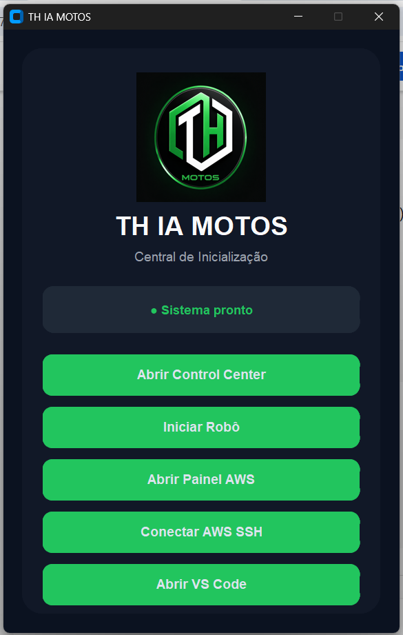
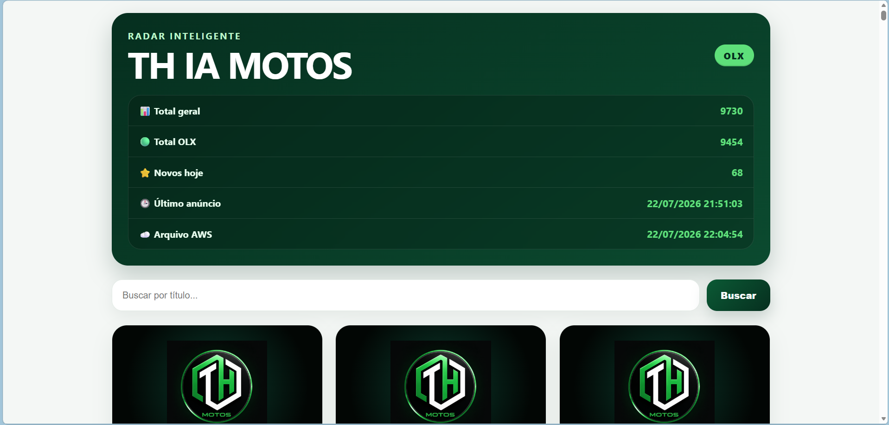
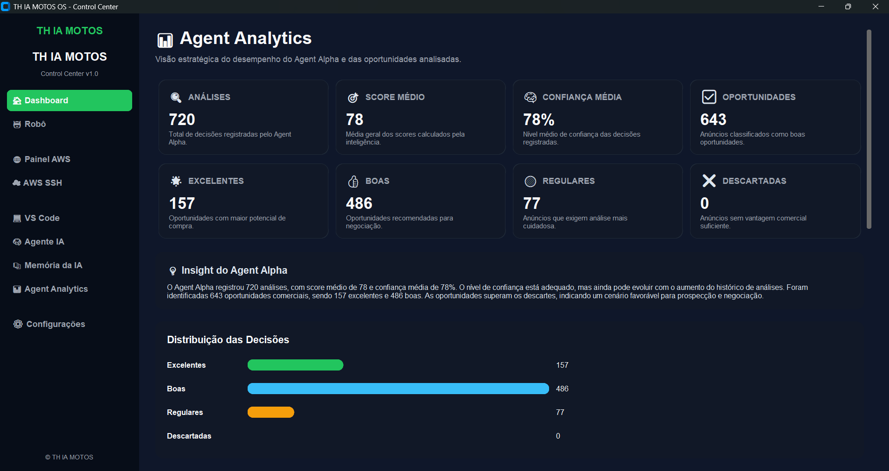
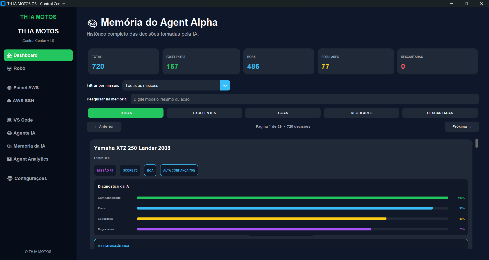
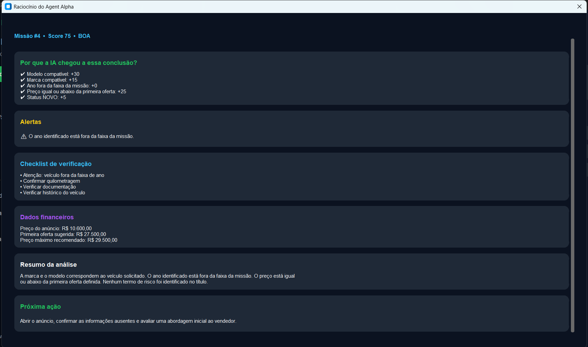
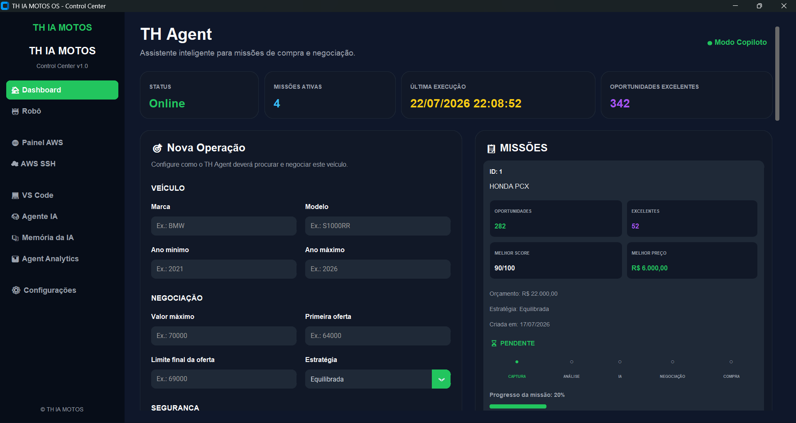

# 🏍️ TH IA MOTOS

## Plataforma inteligente para prospecção e análise de oportunidades em motocicletas

O **TH IA MOTOS** é uma plataforma criada para automatizar a captura, organização e análise de anúncios de motocicletas.

O projeto evoluiu de um robô de monitoramento para um sistema completo, formado por:

- robô de captura;
- painel web hospedado na AWS;
- Control Center operacional;
- gerenciamento de missões;
- análise automatizada das oportunidades;
- memória de decisões;
- indicadores do Agent Alpha;
- integração com Telegram.

---

## Control Center

<p align="center">
  
</p>

## Interface Web

<p align="center">
  
</p>

## Agent Analytics

<p align="center">
  
</p>

## Memória da IA

<p align="center">
  
</p>

## Raciocínio da IA

<p align="center">
  
</p>

## Gerenciamento de Missões

<p align="center">
  
</p>

## 🎯 Objetivo

Reduzir o trabalho manual de pesquisar, comparar e organizar anúncios de motocicletas.

O sistema coleta anúncios, registra as informações encontradas e auxilia na identificação de oportunidades compatíveis com os critérios definidos em cada missão.

---

## ✅ Funcionalidades implementadas

### Captura de anúncios

- Monitoramento automatizado da OLX;
- identificação de novos anúncios;
- prevenção de duplicidades;
- armazenamento estruturado dos resultados;
- registro de data e horário da captura;
- envio de alertas operacionais.

### Interface web

A plataforma possui uma interface web para consulta dos anúncios coletados.

Ela permite:

- visualizar o total de anúncios;
- consultar novos anúncios;
- pesquisar por título;
- visualizar preço e data de captura;
- abrir o anúncio original;
- acompanhar a última atualização;
- consultar o status dos arquivos armazenados na AWS.

### Control Center

O Control Center centraliza a operação da plataforma.

Principais recursos:

- situação do robô local;
- situação da AWS;
- sincronização dos arquivos JSON;
- situação do Telegram;
- últimos anúncios capturados;
- início e encerramento do robô;
- acesso ao painel AWS;
- acesso ao servidor por SSH;
- abertura do projeto no VS Code;
- acesso aos módulos de IA.

### Gerenciamento de missões

O TH Agent permite configurar missões de busca e negociação.

Entre os critérios disponíveis estão:

- marca;
- modelo;
- ano mínimo e máximo;
- valor máximo;
- primeira oferta;
- limite final da oferta;
- estratégia de negociação;
- aprovação humana antes de propostas.

Cada missão mantém informações como:

- oportunidades encontradas;
- oportunidades excelentes;
- melhor score;
- melhor preço;
- progresso da operação;
- última decisão registrada.

### Agent Alpha

O Agent Alpha analisa os anúncios relacionados às missões.

As análises podem considerar:

- compatibilidade com marca e modelo;
- ano do veículo;
- preço;
- situação do anúncio;
- termos de risco;
- potencial de negociação;
- critérios definidos na missão.

O resultado inclui:

- score;
- nível de confiança;
- classificação;
- recomendação;
- alertas;
- checklist de verificação;
- resumo da análise;
- próxima ação sugerida.

### Memória da IA

O sistema mantém o histórico das decisões realizadas.

A memória permite:

- pesquisar análises;
- filtrar por missão;
- filtrar por classificação;
- consultar score e confiança;
- visualizar o diagnóstico da oportunidade;
- abrir o anúncio original;
- consultar o raciocínio registrado pelo agente.

### Agent Analytics

O painel de analytics apresenta indicadores como:

- total de análises;
- score médio;
- confiança média;
- total de oportunidades;
- oportunidades excelentes;
- oportunidades boas;
- oportunidades regulares;
- oportunidades descartadas;
- modelos mais encontrados;
- evolução dos scores e da confiança.

---

## ☁️ Infraestrutura AWS

Parte da plataforma está executando em infraestrutura AWS.

A arquitetura atual permite:

- hospedagem da interface web;
- disponibilização do painel de anúncios;
- sincronização de arquivos operacionais;
- acesso remoto ao servidor;
- acompanhamento do estado da aplicação;
- continuidade da operação fora do computador local.

> Endereços IP, chaves de acesso, credenciais e informações sensíveis não devem ser registrados neste repositório.

---

## 🔄 Fluxo operacional

```text
Marketplaces
     |
     v
Robô de captura
     |
     v
Organização e prevenção de duplicidades
     |
     v
Armazenamento dos anúncios
     |
     +--------------------+
     |                    |
     v                    v
Interface web         Missões
na AWS                    |
                          v
                  Análise do Agent Alpha
                          |
                          v
               Memória e Agent Analytics
                          |
                          v
                    Control Center
```

---

## 🧠 Explicabilidade das análises

Um dos diferenciais do sistema é registrar os motivos utilizados na avaliação de cada oportunidade.

O usuário pode consultar:

- fatores que aumentaram ou reduziram o score;
- alertas encontrados;
- checklist recomendado;
- dados financeiros;
- resumo da avaliação;
- próxima ação sugerida.

Isso permite acompanhar como cada recomendação foi formada.

---

## 📚 Documentação técnica

A documentação detalhada do projeto está disponível nos arquivos:

- [`docs/ARQUITETURA.md`](docs/ARQUITETURA.md)
- [`docs/INTEGRACAO_IA.md`](docs/INTEGRACAO_IA.md)

### Arquitetura

O documento de arquitetura apresenta:

- componentes principais;
- responsabilidades dos módulos;
- organização geral;
- fluxo de dados;
- pontos de integração.

### Integração da IA

O documento de integração apresenta:

- funcionamento atual do Agent Alpha;
- arquivos relacionados às análises;
- estruturas dos dados;
- relação entre missões, oportunidades e decisões;
- orientações para evolução da camada de IA.

---

## 🔒 Segurança

As credenciais utilizadas pelo sistema devem permanecer em variáveis de ambiente.

Exemplo:

```env
TOKEN_TELEGRAM=seu_token_aqui
ID_TELEGRAM=seu_id_aqui
```

Regras importantes:

- nunca enviar o arquivo `.env` ao GitHub;
- nunca registrar tokens no código;
- nunca publicar chaves da AWS;
- nunca publicar arquivos de perfil do navegador;
- revisar o `.gitignore` antes de cada envio;
- substituir imediatamente qualquer credencial exposta.

---

## 🛠️ Tecnologias utilizadas

O projeto utiliza tecnologias e recursos como:

- Python;
- HTML;
- CSS;
- JavaScript;
- arquivos JSON;
- AWS;
- Telegram;
- Git e GitHub;
- interface gráfica local;
- servidor web.

---

## 📊 Estado atual

O TH IA MOTOS já possui uma base operacional composta por:

- captura automatizada;
- interface web;
- infraestrutura AWS;
- Control Center;
- gerenciamento de missões;
- análises automatizadas;
- histórico das decisões;
- indicadores estratégicos;
- documentação da arquitetura;
- documentação da integração da IA.

---

## 👨‍💻 Desenvolvimento

Projeto desenvolvido por **Renato Faria**.

O sistema está em evolução contínua, com arquitetura preparada para receber melhorias na automação, análise de dados e inteligência artificial.