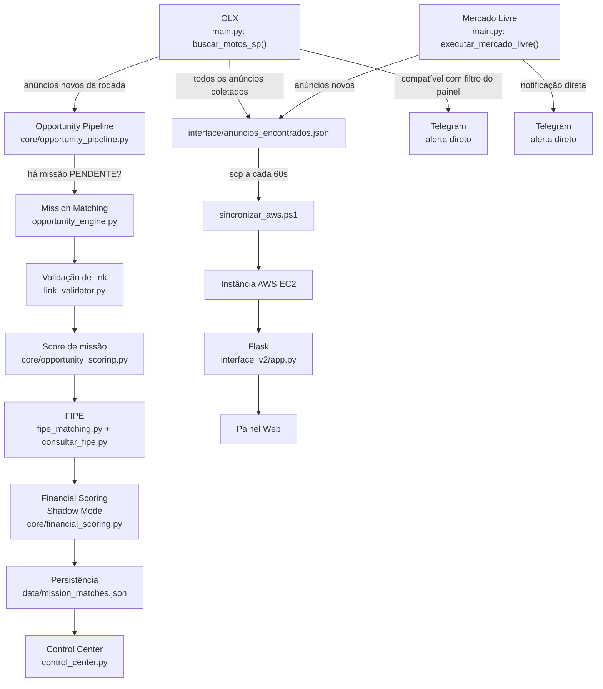

# Arquitetura Técnica — IA_Motos

Este documento descreve a arquitetura real do sistema, com base no código atual da branch `integration/commercial-platform`. Todos os componentes citados existem no repositório nos caminhos indicados.

## Visão geral

O IA_Motos é um sistema de prospecção e triagem de anúncios de motocicletas. Ele coleta anúncios de duas fontes (OLX e Mercado Livre), aplica regras de pontuação determinísticas para avaliar oportunidades contra missões de compra cadastradas pelo usuário, enriquece a análise com o valor de referência FIPE, e disponibiliza os resultados em duas interfaces: um painel de operação local (Control Center, desktop) e um painel de leitura hospedado na AWS (interface_v2, web).

Não há modelo de machine learning nem LLM em nenhuma etapa do pipeline. Toda pontuação (score de missão, score financeiro, resolução de modelo FIPE) é feita por regras determinísticas e configuráveis, descritas em detalhe nas seções abaixo.

## Coleta OLX

Arquivo: [`../main.py`](../main.py)

A função `buscar_motos_sp()` abre um navegador Playwright headless, varre até `MAX_PAGINAS_OLX` páginas de busca da OLX e extrai título, preço, link, imagem e cidade de cada card de anúncio. Para cada anúncio novo (link ainda não visto, registrado em `anuncios_vistos.json`):

- é comparado contra os **filtros do painel** (`interface/filtros.json`, gerenciados pela interface web) via `anuncio_compativel()`;
- é enviado diretamente ao Telegram (`enviar_telegram()`) — para o destinatário do filtro correspondente, ou para os destinatários padrão quando não há filtro compatível;
- é salvo em `interface/anuncios_encontrados.json`, o histórico consumido tanto pelo painel web (`interface_v2`) quanto pelo Opportunity Pipeline.

Este envio ao Telegram por filtro é **independente** do fluxo de missões descrito a seguir — os dois consomem os mesmos anúncios coletados, mas por caminhos de código separados.

## Mercado Livre

Arquivos: [`../buscar_motos_ml.py`](../buscar_motos_ml.py), [`../integracao_ml_preview.py`](../integracao_ml_preview.py), [`../integrador_mercado_livre.py`](../integrador_mercado_livre.py), [`../mercado_livre_playwright_stealth.py`](../mercado_livre_playwright_stealth.py), [`../config_ml.py`](../config_ml.py)

Executada em paralelo ao OLX, dentro do mesmo loop de `main.py` (`executar_mercado_livre()`), controlada pela flag `ATIVAR_MERCADO_LIVRE` em `config_ml.py`. Também salva no mesmo `interface/anuncios_encontrados.json` (com `origem: "Mercado Livre"`) e envia notificações Telegram próprias, com deduplicação registrada em `interface/ml_enviados.json`.

**Importante:** anúncios do Mercado Livre atualmente **não** entram no Opportunity Pipeline / Mission Matching — apenas os anúncios da rodada OLX (`novos_olx`) são repassados a `opportunity_pipeline.processar_rodada()`.

## Fluxo incremental e Opportunity Pipeline

Arquivo: [`../core/opportunity_pipeline.py`](../core/opportunity_pipeline.py)

Depois de cada rodada OLX, `main.py` chama `opportunity_pipeline.processar_rodada(novos_olx)`, passando **apenas os anúncios novos daquela rodada** (nunca o histórico completo). O pipeline:

1. adquire um lock em arquivo (`data/opportunity_pipeline.lock`), confirmando via PID que nenhuma outra análise já está em execução — nunca encerra processos, apenas recusa iniciar uma segunda análise concorrente;
2. verifica se há missões com `status == "PENDENTE"` (via [`../mission_manager.py`](../mission_manager.py)); se não houver, encerra sem processar;
3. chama `opportunity_engine.buscar_oportunidades()`;
4. nunca propaga exceção para `main.py` — qualquer falha vira um resumo estruturado (`sucesso: False`, motivo) e é registrada em log.

## Mission Manager

Arquivo: [`../mission_manager.py`](../mission_manager.py)

Persiste missões de compra em `data/missions.json`. Cada missão tem marca, modelo, faixa de ano, orçamento máximo, primeira oferta, limite final de negociação, estratégia (`agressiva`/`conservadora`) e status (`PENDENTE`, `EM_EXECUCAO`, `NEGOCIANDO`, `FINALIZADA`, `CANCELADA`, `COMPRADA`). Valida duplicidade de missões idênticas antes de criar, e ao excluir uma missão remove também suas oportunidades relacionadas em `data/mission_matches.json`.

## Mission Matching e link validation

Arquivo: [`../opportunity_engine.py`](../opportunity_engine.py)

Para cada missão `PENDENTE`, casa os anúncios recebidos por título (marca/modelo como palavra completa, nunca substring solta) e por preço dentro do orçamento. Candidatos compatíveis passam por validação de link antes de virarem oportunidade:

Arquivo: [`../link_validator.py`](../link_validator.py) — abre o anúncio num navegador headless e verifica se o texto da página indica remoção (`"anúncio não encontrado"`, etc.). Anúncios `REMOVIDO` são descartados antes de qualquer pontuação.

## Score de missão (opportunity scoring)

Arquivo: [`../core/opportunity_scoring.py`](../core/opportunity_scoring.py)

Função `analisar_oportunidade()`. Score de 0 a 100 por soma de pesos configuráveis (`data/agent_settings.json`, com fallback para `CONFIGURACOES_PADRAO`): modelo compatível, marca compatível, ano dentro/um-ano-abaixo da faixa da missão, preço na primeira oferta/limite final/orçamento, status novo, penalidade por palavras de risco (sinistro, leilão, sucata, etc.), bônus/penalidade por estratégia. Classificação final por faixas configuráveis: `EXCELENTE` / `BOA` / `REGULAR` / `DESCARTAR` (padrão: ≥85 / ≥70 / ≥50 / abaixo). Gera também resumo textual, ação recomendada e checklist de verificação — tudo por regras, sem IA generativa.

## FIPE

Arquivos: [`../consultar_fipe.py`](../consultar_fipe.py), [`../fipe_matching.py`](../fipe_matching.py)

`consultar_fipe.py` consulta a API pública da FIPE (Parallelum), com cache local em `interface/fipe_motos.json`. A resolução de qual "modelo" de catálogo FIPE corresponde ao anúncio é conservadora e determinística: filtra por tokens completos do modelo (nunca substring), exige o ano exato disponível no catálogo, e só escolhe automaticamente quando sobra exatamente 1 candidato (ou um único candidato mais específico em caso de empate) — caso contrário retorna erro explícito de ambiguidade, nunca um palpite.

`fipe_matching.py` chama essa consulta **depois** do score de missão já estar fechado, só para enriquecer a oportunidade com `valor_fipe`, `diferenca_fipe_reais` e `diferenca_fipe_percentual` — nunca altera o score ou a recomendação da missão. Só tenta consultar quando o título do anúncio tem exatamente um ano identificável (ano ausente ou ambíguo → FIPE não é consultada).

## Financial Scoring (Shadow Mode)

Arquivo: [`../core/financial_scoring.py`](../core/financial_scoring.py)

Módulo puro (sem I/O, sem chamadas de rede), que converte `diferenca_fipe_percentual` em um `score_financeiro` (0–100, por interpolação linear entre âncoras configuráveis) e uma classificação textual (`MUITO_ALTA` a `MUITO_BAIXA`). Combina esse score com o score de missão em um `score_final_experimental` (peso padrão 70% missão / 30% financeiro) e calcula um `preco_alvo_negociacao` sugerido.

**Shadow mode**: todos esses campos (`score_financeiro`, `classificacao_financeira`, `score_final_experimental`, `classificacao_final_experimental`, `preco_alvo_negociacao`) são gravados em `data/mission_matches.json` **adicionalmente** aos campos oficiais (`score`, `recomendacao`) — nunca os substituem. Quando não há FIPE disponível, o score financeiro é `None` e o score final experimental degrada para o score de missão puro.

## Persistência operacional

- `data/missions.json` — missões cadastradas
- `data/mission_matches.json` — oportunidades encontradas (score, recomendação, campos shadow mode)
- `data/agent_decisions.json` — histórico de decisões, gravado por [`../agent_decision_history.py`](../agent_decision_history.py) a cada oportunidade processada
- `interface/anuncios_encontrados.json` — histórico bruto de anúncios coletados (OLX + Mercado Livre), consumido pelo painel web
- `interface/fipe_motos.json` — cache de consultas FIPE já resolvidas
- `anuncios_vistos.json` / `interface/ml_enviados.json` — controle de deduplicação (links já vistos / já notificados)

Todos esses arquivos são ignorados pelo Git (dados operacionais, não código).

## Control Center

Arquivo: [`../control_center.py`](../control_center.py)

Aplicação desktop (CustomTkinter) com as telas: Dashboard, Robô, Agente IA (missões), Memória da IA (`tela_memoria_ia`, histórico de decisões), Agent Analytics (`tela_agent_analytics`), Calibração Financeira (`tela_calibracao_financeira`, observabilidade do shadow mode) e Configurações. Lê os dados operacionais via [`../core/dashboard_service.py`](../core/dashboard_service.py), que só agrega/lê — nunca importa os módulos de scoring diretamente. Inicia/para o robô (`main.py`) através de [`../core/robo_process.py`](../core/robo_process.py), que confirma por linha de comando que um PID pertence de fato ao robô antes de considerá-lo "rodando" ou de encerrá-lo.

## Launcher

Arquivo: [`../launcher_gui.py`](../launcher_gui.py)

Janela de entrada do sistema, com botões para iniciar/parar o robô, iniciar/parar a sincronização AWS, abrir o Control Center, abrir o painel web, conectar via SSH à instância AWS e abrir o projeto no VS Code. Mantém um indicador de status do Sync AWS atualizado a cada 15 segundos.

## AWS Sync

Arquivos: [`../sincronizar_aws.ps1`](../sincronizar_aws.ps1), [`../core/aws_sync_process.py`](../core/aws_sync_process.py)

`sincronizar_aws.ps1` roda em loop contínuo, copiando `interface/anuncios_encontrados.json` para a instância AWS via `scp` a cada 60 segundos. `core/aws_sync_process.py` gerencia esse processo com segurança (identifica pelos processos `powershell.exe` cuja linha de comando referencia o script, nunca encerra um processo não confirmado).

## interface_v2

Arquivo: [`../interface_v2/app.py`](../interface_v2/app.py)

Painel web Flask, hospedado na instância AWS, que lê o `anuncios_encontrados.json` sincronizado e renderiza os anúncios de origem OLX (busca, ordenação por data, contadores). Rota `/health` para checagem de disponibilidade.

## Fluxo consolidado

## Observações importantes

- **Mission Matching (missões) e filtros do painel são fluxos independentes** que consomem os mesmos anúncios OLX coletados, mas por caminhos de código separados — filtros disparam Telegram direto em `main.py`; missões alimentam o Opportunity Pipeline e o Control Center.
- **Não há integração automática entre Mercado Livre e o Opportunity Pipeline** no estado atual do código.
- O termo "Agent Alpha"/"IA" usado nas telas do Control Center refere-se ao motor de regras determinísticas descrito acima (`core/opportunity_scoring.py`), não a um modelo de aprendizado de máquina.
